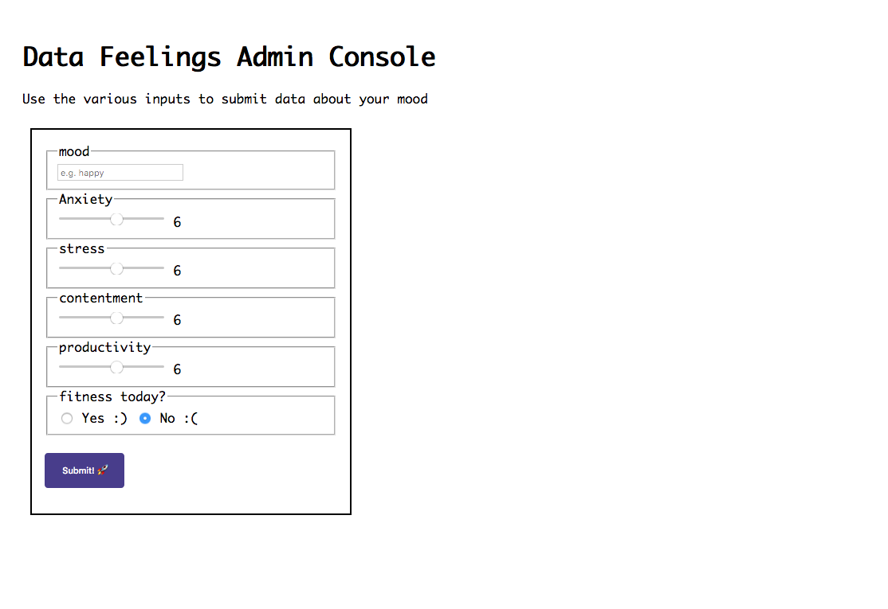
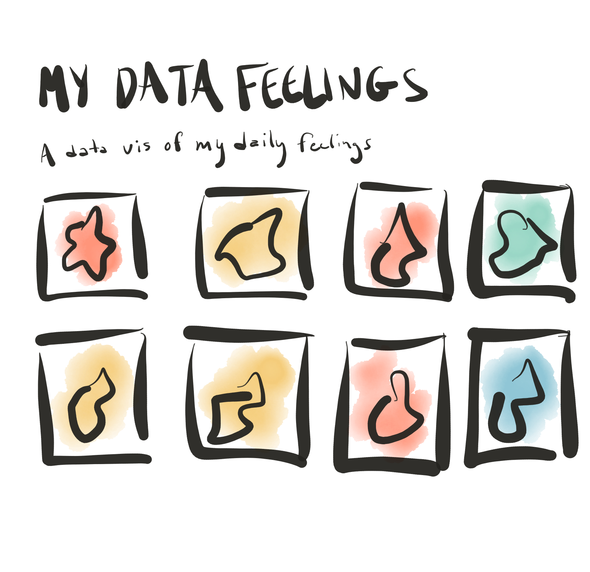
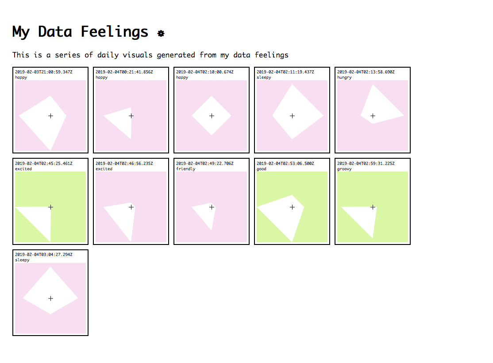
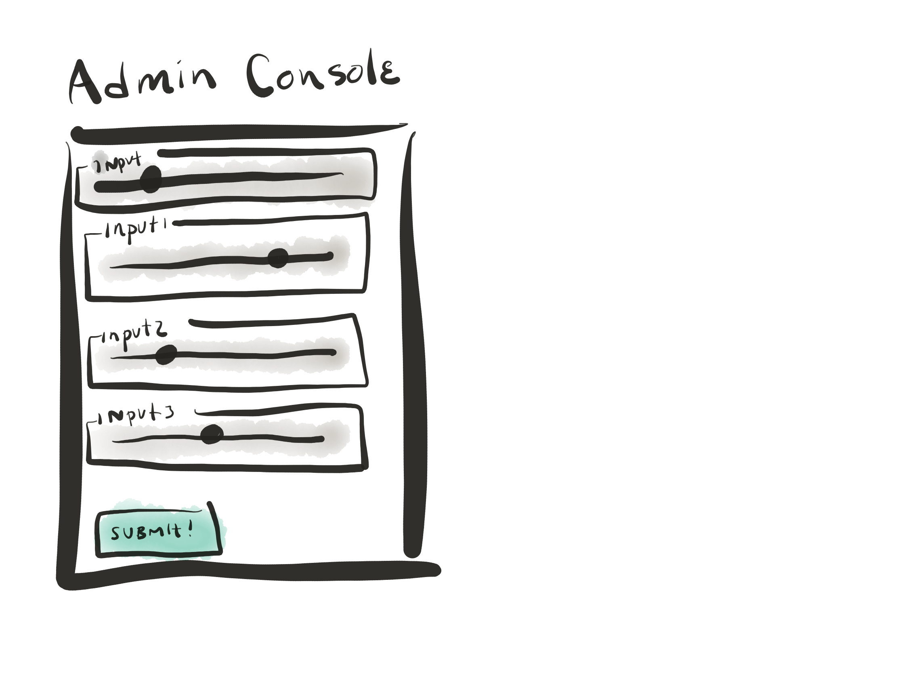

# feathers-p5-example



> In this example we setup a feathersjs app that does the following:

1. adds p5.js to the public/index.html file
2. adds authentication to the feathersjs project
3. adds a mongoose database called `feelings`
4. creates a set of form inputs using p5js
5. sends form input data to feathersjs 
6. uses that data to create a p5 visualization
7. Deploy to Heroku or digital ocean (this takes a few steps)


What concepts we need to think about:

* client vs. server side code
* what is an API?
* what is REST? what's a web socket? why choose one or the other?
* JSON and data models

## Steps:

## Setup

#### install the homebrew package manager for mac
open up your terminal. Copy and paste the following and press enter:

```
/usr/bin/ruby -e "$(curl -fsSL https://raw.githubusercontent.com/Homebrew/install/master/install)"
```


#### install Node.js using homebrew - a server side programming language/environment
After that finishes installing (you may be prompted to install things like XCode in the process), then copy and paste the following:

```
brew install node
```

### Install Mongodb
see: https://treehouse.github.io/installation-guides/mac/mongo-mac.html

```sh
brew install mongodb
```

make a data folder where your mongodb will live
```sh
mkdir -p /data/db
```

make sure you have the right permissions
```sh
sudo chown -R `id -un` /data/db
# Enter your password
```


### Run Mongodb

in your commandline run:
```sh
mongod
```

This will start up mongodb on your machine and will 

### generate the feathers app
> to produce this app

```sh
# install the feathers command line scaffolding interface
npm install -g @feathersjs/cli

# make a project folder
mkdir my-awesome-app

# change directories
cd my-awesome-app

# create the app scaffold:
feathers generate app

? Project name my-awesome-app
? Description
? What folder should the source files live in? src
? Which package manager are you using (has to be installed globally)? npm
? What type of API are you making? (Press <space> to select, <a> to toggle all,
<i> to invert selection)REST, Realtime via Socket.io
? Which testing framework do you prefer? Mocha + assert

```

### include p5js in the the index.html file

add your p5.js library and a `index.js` file 
in public/index.html
```
<script src="https://cdnjs.cloudflare.com/ajax/libs/p5.js/0.7.3/p5.min.js"></script>
<script src="https://cdnjs.cloudflare.com/ajax/libs/p5.js/0.7.3/addons/p5.dom.js"></script>
<script src="https://cdnjs.cloudflare.com/ajax/libs/p5.js/0.7.3/addons/p5.sound.min.js"></script>
<script src="index.js"></script>
```


### add some boilerplate code to your p5 index.js 

Just to check if things are working, add some P5 code in.

```js
function setup(){
    createCanvas(400, 400)

}

function draw(){    
    background(200);
    ellipse(mouseX, mouseY, 50, 50);

}
```

### Checkpoint 1: Check to see if your app is running

run `npm run dev` in the root directory. If all goes well you'll see that your app is running on: `localhost:3030`

You should see something like:


### Now Let's add in our first `feelings` database

```sh

feathers generate service
```

you'll get a bunch of prompts. Here's what I chose:

```sh
? What kind of service is it? Mongoose
? What is the name of the service? feelings
? Which path should the service be registered on? /feelings
? What is the database connection string? mongodb://localhost:27017/feathers_p_5
_example
```

NOTE: The databse connection string might be slightly different for you. 

Hooray! you've just created your first Mongodb database and it's already all wired up to your app! 

### Check that your database is up and running

You can check if your databse is going to send us results by checking:

`localhost:3030/feelings`

if you get back a page that shows a json result, then we're in business! 

```json
{"total":0,"limit":10,"skip":0,"data":[]}
```

At this point, if something went wrong, make sure of 2 things:
1. you're running `npm run dev` to make sure your server reloads when you make changes to anything in your project repository
2. your mongodb is alive by running `mongod` in your terminal. Ensure that your mongodb is able to send and recieve data from your server :) 


### What's happening when you go to `localhost:3030/feelings`?

This is super interesting. We go to a URL and at that URL endpoint, we get back a search result from our database. Since nothing is in there at the moment, we see that our `data:[]` property is an empty array. 

Behind the scenes, feathers.js has set up an entire node.js/express app with REST endpoints for our feelings database. This means we can make GET, PUT, POST, DELETE requests to our featherjs server. Typically to do this, there are a lot more steps and code that you'd need to write yourself, but feathersjs tries to take care of all that as much as possible for us. 


### Edit the `feelings` model

Navigate to src/models/feelings.model.js

Untouched, our model looks like this:

```js
// feelings-model.js - A mongoose model
// 
// See http://mongoosejs.com/docs/models.html
// for more of what you can do here.
module.exports = function (app) {
  const mongooseClient = app.get('mongooseClient');
  const { Schema } = mongooseClient;
  const feelings = new Schema({
    text: { type: String, required: true }
  }, {
    timestamps: true
  });

  return mongooseClient.model('feelings', feelings);
};

```

Let's add some properties that might be of interest for us:

```js
// feelings-model.js - A mongoose model
// 
// See http://mongoosejs.com/docs/models.html
// for more of what you can do here.
module.exports = function (app) {
  const mongooseClient = app.get('mongooseClient');
  const { Schema } = mongooseClient;
  const feelings = new Schema({
    mood: { 
        type: String, // text
        required: true 
    },
    anxiety:{
        type: Number, // scale from 1 to 10
        required: true
    },
    stress:{
        type: Number, // scale from 1 to 10
        required: true
    },
    contentment:{
        type: Number, // scale from 1 to 10
        required: true
    },
    productivity:{
        type: Number, // scale from 1 to 10
        required: true
    },
    fitness:{
        type: Boolean, // true or false
        required: true
    }
  }, {
    timestamps: true
  });

  return mongooseClient.model('feelings', feelings);
};

```

Save your file and know that when it comes time to submitting data to our database, our database will only accept those data properties of those types. This is good practice to make sure that the data you're getting is the type you want it to be.

### Your first POST request. Test that your feelings database is working by posting using CURL

CURL is a commandline tool that allows you to make requests of servers. Using this nice list of CURL requests -- https://gist.github.com/subfuzion/08c5d85437d5d4f00e58 --, let's send some data to our database 

```sh
curl -d '{"key1":"value1", "key2":"value2"}' -H "Content-Type: application/json" -X POST http://localhost:3000/data
```

so for us we could do:

```sh
curl -d  '{"mood":"happy", "anxiety": 5, "stress": 6, "contentment": 10, "productivity": 9, "fitness": false}' -H "Content-Type: application/json" -X POST http://localhost:3030/feelings
```

If all is well, we'll get a result that looks like:

```sh
{"_id":"5c57568bffeba6503d82bb2c","mood":"happy","anxiety":5,"stress":6,"contentment":10,"productivity":9,"fitness":false,"createdAt":"2019-02-03T21:00:59.347Z","updatedAt":"2019-02-03T21:00:59.347Z","__v":0}%
```

Notice we have an `_id` field that has been populated as well as a `createdAt` and `updatedAt` property. It's working!!!


Now, try again going to `localhost:3030/feelings` and see that we now can see the data we just posted:

```json
{"total":1,"limit":10,"skip":0,"data":[{"_id":"5c57568bffeba6503d82bb2c","mood":"happy","anxiety":5,"stress":6,"contentment":10,"productivity":9,"fitness":false,"createdAt":"2019-02-03T21:00:59.347Z","updatedAt":"2019-02-03T21:00:59.347Z","__v":0}]}
```

HOW COOOL IS THISSSSSSS!!!! I can hardly contain myself. I hope you are feeling the same excitement as me! Now, before we go totally off the rails, let's build out an interface in which to submit and visualize data using p5.js

### Checkpoint #2

Ok, so we've made it this far:

On the backend...
- we have a nodejs/express app that was generated using feathersjs with REST endpoints setup for our `feelings` database
- Our feelings database has a data model which includes a variety of text, numerical, and boolean types of data fields 
- we have data now living in our database

On the front end... 
- we have a basic html file and p5.js included. 

Some questions we will need to answer:
- 1. Can we build a basic interface to **browse** what is living in our database?
- 2. Can we build a basic interface to **submit** to our database?

The answer to both of those questions is undoubtedly yes, however the question is how? 

Let's approach it super simply for now:

First: let's create a page to display our data visuals (these will be super simple for now, but you will make them awesome).
Second: let's create a page to submit our data feelings.


### Frontend 1: Our data feelings page



We will first work on the visualization page that allows us to see our data feelings. 

To do this we will add some html to our `public/index.html` as well as our `public/index.js` file.

In the `public/index.html` you'll see a fairly straightforward html file with some elements and css commands. Here we specifically we use [CSS Grid](https://www.w3schools.com/css/css_grid.asp) which is a modern CSS syntax for making grids for the web. There's an excellent post on the [Times.nytimes.com blog about CSS Grid](https://open.nytimes.com/css-grid-for-designers-f74a883b98f5). 

The most significant part of our data feelings page css is here:

```css
.grid-container {
    display: grid;
    grid-column-gap: 10px;
    grid-row-gap: 10px;
    grid-template-columns: repeat(auto-fill, 172px);
    padding-bottom:60px;
  }
```

the property `grid-template-columns: repeat(auto-fill, 172px);` reads as: 
> create a column that is 172 pixels wide and fill the column until the end of the page, then start again on the next row.

In the `public/index.js` file we've got some more stuff to unpack. Let's break down the important bits:

```js
function preload(){
    // request your data using the loadJSON function which makes a GET request to he URL provided
    dataFeelings =  loadJSON("/feelings?$limit=false");
}
```

Here, we are making a GET request to our feelings database with a query parameter `$limit=false` so that our feathersjs knows to give us all the data rather than splitting it up into paginated chunks. After preload runs, we will have our data to work with in p5. 


How do we split our visualization into many canvases rendering our data across the page? We use the [p5 instance mode](https://github.com/processing/p5.js/wiki/Global-and-instance-mode) to achieve this. In our `index.js` file, you'll see that we've got a class called `MyFeelings` and a `render()` function that has some funky stuff in there. What the p5 instance mode allows us to do is create as many instances of p5 sketches on a page and target specific dom elements in which to add these sketches. 

```js
class MyFeelings {
  ...

  render(sketch){
      ...

      sketch.setup = function(){

      }
      sketch.draw = function(){
          
      }
  }

  ...
}

```

In render, we put all of the logic for how to generate our data visuals! SO EXCITING. This is where you'll have the opportunity to get create and start iterating on design considerations that make for thoughtful and meaningful visual encodings.

Here's an example of simple example of what my data feelings look like:



You might imagine that as you collect more data and as you perhaps change the type of data you collect what kinds of visual feedback might be interesting or important for you. I encourage you to try different types of things here. 

Now let's build our admin interface

### Frontend 2: Our data admin console


Now we will make a page that gives us a visaul interface that allows us to submit new data to our data feelings page. You could spend the rest of your life making `curl` requests, but hey! we're designers and we like interfaces. Also you can imagine then we can start adding data on other devices like our mobile phones ;) 

Now take a peek into `public/admin/index.html`:

You'll see again more html markup and some additional CSS. The most notable and important feature is the html `form` element. The form element has some notable characteristics.

The form has:
- an ID that will allow us to select that element with javascript later on 
- an `action` that tells the form where to submit
- a `method` that specifies what kind of request will be made on `submit`
- we will attach an event listener on this form using p5.js to handle how or data gets sent to the server.
- when the `input type=submit` is clicked, it will trigger the form submission.

```html
<form id="moodForm" action="/feelings" method="post">
        <fieldset>
          <legend>mood</legend>
          <input type="text" id="mood-input" name="mood" placeholder="e.g. happy">
        </fieldset>
        ...

        <input id="submit-input" type="submit" value="Submit! 🚀">
</form>

```

Now you may be wondering, why should I write all this markup if I can just make those elements in p5? Well you're welcome to do this, but it can be easier to visualize how things are getting laid out when you write the markup out like this.

Now, let's look at `public/admin/index.js`

The more important feature here is how we handle the data submission in the form. When the form is submitted, this will trigger this event callback function. In javascript there is an object called FormData that makes it easier for us to pull out all the set values of a form much more easily. You can see that at the end of the `handleSubmit()` function that we call `httpPost()` which is a p5 function for delivering a POST request with some JSON data. When the POST has been made a callback function called `finished()` is called to redirect us to our super cool visualizaiton page. 

```js
// handleSubmit is the callback function for the form submission
function handleSubmit(e){
    e.preventDefault();
    console.log("form submitted!")

    // since we're working with an html form, we need to be able to retrieve the values from the  form
    // we do so using the form.get(nameOftheInput);
    const myForm = new FormData(e.currentTarget);
    const payload = {
        anxiety: myForm.get('anxiety'),
        contentment: myForm.get('contentment'),
        fitness: myForm.get('fitness'),
        mood: myForm.get('mood'),
        productivity: myForm.get('productivity'),
        stress: myForm.get('stress')
    }
    // https://github.com/shiffman/itp-networked-media/wiki/GET,-POST-with-p5
    httpPost("/feelings", payload, finished)
}
```


My submission form looks pretty basic like this: 


WOW! Try submitting a few data feelings and see what starts to get generated in the browse page. The idea is that with some thoughtful visual encodings and with a larger dataset you'll start to be able to look back into time and to use these visuals to guide you in your reflection about a specific time or place or moment in your life. 

## Checkpoint #3

Take some time to revel in the glory that you've just made a full blown web application with a database and all. It isn't deloyed yet to the web and we haven't defined our authentication methods, but we will add that on top of our application soon. For now, take some time to think about what might be something you'd like to track this week and how you might try to attach some meaningful or intriguing visuals to those data. 


***
***
***

## About

This project uses [Feathers](http://feathersjs.com). An open source web framework for building modern real-time applications.

## Getting Started

Getting up and running is as easy as 1, 2, 3.

1. Make sure you have [NodeJS](https://nodejs.org/) and [npm](https://www.npmjs.com/) installed.
2. Install your dependencies

    ```
    cd path/to/feathers-p-5-example; npm install
    ```

3. Start your app

    ```
    npm start
    ```

## Testing

Simply run `npm test` and all your tests in the `test/` directory will be run.

## Scaffolding

Feathers has a powerful command line interface. Here are a few things it can do:

```
$ npm install -g @feathersjs/cli          # Install Feathers CLI

$ feathers generate service               # Generate a new Service
$ feathers generate hook                  # Generate a new Hook
$ feathers help                           # Show all commands
```

## Help

For more information on all the things you can do with Feathers visit [docs.feathersjs.com](http://docs.feathersjs.com).

## Changelog

__0.1.0__

- Initial release

## License

Copyright (c) 2018

Licensed under the [MIT license](LICENSE).
